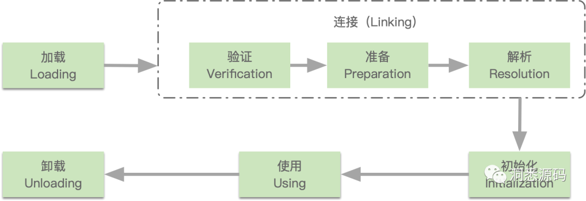
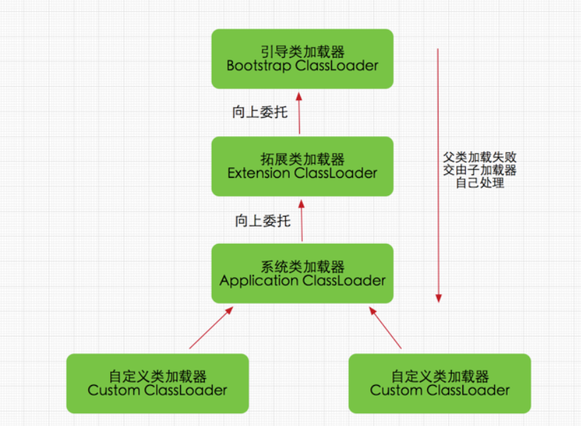
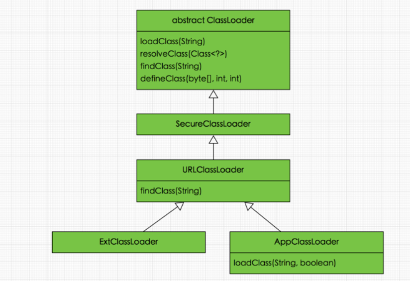
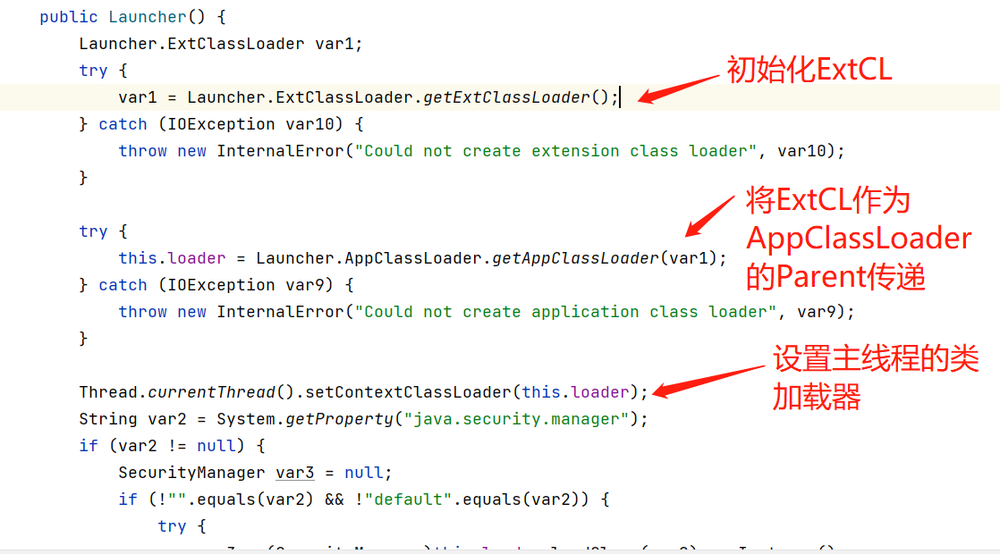
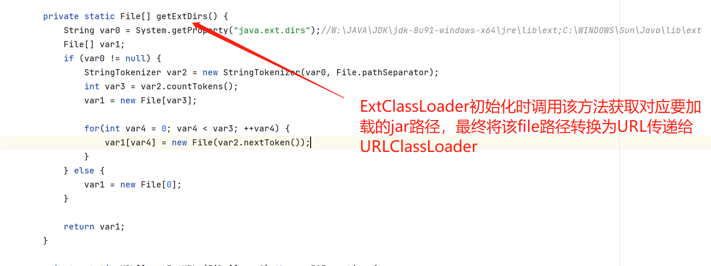
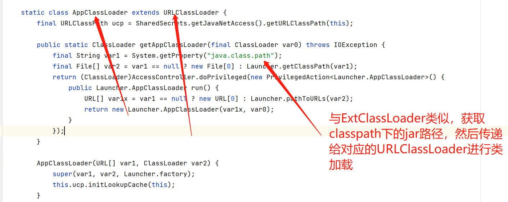

# 概括

本篇作为随笔存在，非系统性的文章内容，网络上关于ClassLoader的文章已经很多了，**此处做下自己使用时的一些简单记录，便于后续自己回忆使用**。

## 逻辑结构

类加载过程：


类加载器逻辑结构：


实际类结构：



关于各类加载器作用及双亲委派的机制，有些博主已经写的很好了，文章结尾处会列出相应的文章链接，欢迎查看。

## ClassLoader常用方法

* **loadClass(String)**

  该方法加载指定名称（包括包名）的二进制类型，该方法在JDK1.2之后不再建议用户重写但用户可以直接调用该方法，loadClass()
  方法是ClassLoader类自己实现的，该方法中的逻辑就是双亲委派模式的实现，详细源码较为简单，直接查看JDK实现即可。

* **findClass(String)**

  findClass()方法是在loadClass()方法中被调用的，当loadClass()方法中父加载器加载失败后，则会调用自己的findClass()方法来完成类加载，这样就可以保证自定义的类加载器也符合双亲委托模式。


* **defineClass(byte[] b, int off, int len)**
  defineClass()方法是用来将byte字节流解析成JVM能够识别的Class对象(ClassLoader中已实现该方法逻辑)。

* **resolveClass(Class≺?≻ c)**
  使用该方法可以使用类的Class对象创建完成也同时被解析。

# URLClassLoader

URLClassLoader可以说是ClassLoader的具体实现，较为关键的是URLCLassLoader实现了针对具体URL加载字节码流的功能，我们所熟知的ExtClassLoader和AppClassLoader也都是继承URLClassLoader来进行实现的。

ExtClassLoader和AppClassLoader类是Launcher的内部类，源码如下



ExtClassLoader：



AppClassLoader：



ExtClassLoader中未重写loadClass()方法，AppClassLoader中重写了loadClass()方法，但最终还是调用的super.loaderClass()，仍然未破坏类加载机制。

看到这里，我想也都关注到重点了，无论是AppClassLoader和ExtClassLoader都是继承了URLClassLoader后进行的实现。我们日常会经常在获取到ClassLoader后.getResouce()
等操作，实际上我们在获取到ClassLoader后所使用的API，大多数也都是URLClassLoader所提供的代码实现。

```
Thread.currentThread().getContextClassLoader().getResource()
Class.class.getClassLoader().getResource()
```

所以研究URLClassLoader实际上是很具备价值的。

**另外Tips下：不要尝试去debug Launcher类下的代码，因为java所提供的JDI（Java Debug
IntegerFace）的功能，是由BootStrapClassLoader来进行加载的，而在加载JDI之前，是会先加载Launcher类的，所以在JDI初始化完成后，Launcher本身已经被加载过了，所以针对Launcher的debug本身就是无效的。**

# 模块划分

共分为如下三个模块：

1、验证自定义类加载的使用及注意事项，源码为：[PluginClassLoader01](src/main/java/com/smart/heart/classloader/rewrite01/PluginClassLoader01.java)

* 使用URLClassLoader加载外部类和外部Jar包

2、验证自定义类加载器所加载的类在主服务中的调用方式，以及TCL的概念，为什么说TCL是对双亲委派原则的破坏。源码为：[PluginClassLoader02](src/main/java/com/smart/heart/classloader/rewrite02/PluginClassLoader02.java)

* 开发一个Interface接口jar包，新建项目引入该接口jar包并实现该接口，主项目中加载并调用该Plugin插件。

3、验证不兼容Jar包在同一个服务中引入并存在的情况，源码为：[PluginClassLoader03](src/main/java/com/smart/heart/classloader/rewrite03/PluginClassLoader03.java)

* 类隔离，ES5，ES6共存的情况。
