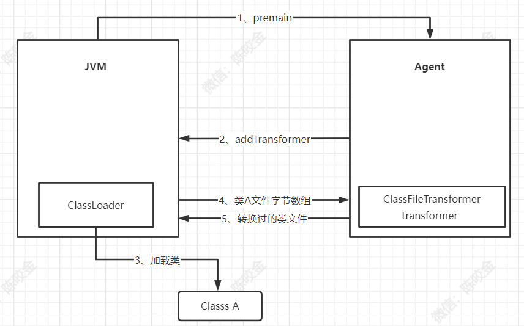

轻轻松松学会Java Agent，

轻轻松松玩转Java Agent，

轻轻松松搞定Java Agent，

轻松搞定Java Agent

Java Agent有什么作用呢？好处是什么？

好比：位计算的好处是什么呢？放在首位。

# 概述

1、想要在JVM进程启动时，动态修改各个类实现？怎么做？

2、想要在JVM进程启动后，动态修改对应类的实现并重新加载到对应JVM进程中？怎么做？

**很简单，只需要JVM在加载Class后，调用开发者提供的代理进行Class修改即可。而这个代理，实际上就是Java Agent。（这段内容想了很久，细品一下）**

那我们如何开发这样一个代理？先不要急，开发这样一个代理，只需要按照JVM的规范来即可，并不复杂，但是在开发代理之前， 我们需要先搞定一些基础知识：如何操作字节码。

# 字节码

一个Java文件中的源代码只有先编译为对应的.class文件后，才能被JVM解释执行，而这个class文件中的内容就叫做字节码。

当一个类被JVM加载后，实际加载的是该类的.class文件，那么我们要修改该类的具体实现时，也就是要修改该类的字节码内容。

那么如何操作字节码？不能说很简单，只能说Java的生态太丰富了，关于操作字节码的库也有很多很多可供挑选使用的。

* ASM：功能齐全、高性能、需要熟练掌握Java字节码相关知识、学习复杂度：中上。
* Javassist：功能齐全、需要适度的Java字节码知识、学习复杂度：低
* Cglib：基于ASM进行的封装、几乎无需字节码知识、简单易学
* ByteBuddy：基于ASM，API友好，几乎无需字节码知识，简单易学

一般情况下对性能有较高要求的情况下使用ASM会更多一些，Cglib和ByteBuddy均是基于ASM进行的封装，所以可知ASM在整个字节码操作上的地位。

Cglib：在动态代理上的使用较多，如Spring中使用Cglib为AOP提供方法拦截，MyBatis中基于Mapper接口生成动态代理实现类等等。

Javassist：Dubbo中提供了Javassist和JDK两种动态代理机制，默认为Javassist，Dubbo中所给出的性能测试结果是：Javassist > Cglib > JDK

ByteBuddy：Skywalking、Datadog 等使用ByteBuddy 作为 Java 应用程序的探针来采集监控信息。

关于更多字节码库的讨论可以参考[这里](https://stackoverflow.com/questions/9167436/dynamic-java-bytecode-manipulation-framework-comparison)

## Javassist

1、此处以Javassist为例，演示下如何使用Javassist来操作字节码  [Javassist Github](https://github.com/jboss-javassist/javassist)
、 [Javassist官方文档](http://www.javassist.org/tutorial/tutorial.html)

2、从当前开始后续所列出的所有代码均已托管在Github上，源码地址为 [java-agent](https://github.com/DearZh/smart-heart/tree/master/java-agent)

3、W:\JAVA\arnoldworkspace\smart-heart\java-agent 为本人的开发目录，后续会频繁出现该路径，大家知晓这实际是项目的工作路径即可。

使用Javassist创建一个class

```
  ClassPool cp = ClassPool.getDefault();
  CtClass ct = cp.makeClass("com.smart.heart.Hello");
  ct.writeFile(writeFilePath);
```

最终所创建的class内容为：

```java
package com.smart.heart;

public class Hello {
    public Hello() {
    }
}
```

我们先定义一个现有的MyMain类，类代码如下：

```java
package com.smart.heart.proxy.javassist;

public class MyMain {
    public void test() {
    }
}
```

然后使用Javassist编辑现有MyMain类的字节码,在该Class的原有方法中增加一段源代码：

```
public static void updateMethod(String writeFilePath) throws Exception {
        ClassPool cp = ClassPool.getDefault();
        //get MyMain类
        CtClass ct = cp.get("com.smart.heart.proxy.javassist.MyMain");
        //获取该类的test()方法
        CtMethod ctMethod = ct.getMethod("test", "()V");
        //在该方法前执行前插入一段System.out的源码
        ctMethod.insertAfter("System.out.println(123);");
        ct.writeFile(writeFilePath);
    }
```

执行如上代码后，输出对应的MyMain.class所对应的内容如下：

```java
package com.smart.heart.proxy.javassist;

public class MyMain {
    public MyMain() {
    }

    public void test() {
        Object var2 = null;
        System.out.println(123);
    }
}
```

仍然使用Javassist编辑现有MyMain类的字节码，给对应的Class增加一个新的方法体:

```
public static void classAddMethodMd(String writeFilePath) throws Exception {
        ClassPool cp = ClassPool.getDefault();
        CtClass ct = cp.get("com.smart.heart.proxy.javassist.MyMain");
        //定义方法：方法名为 foo 对应的方法参数类型为：int，int
        CtMethod ctMethod = new CtMethod(CtClass.intType, "foo", new CtClass[]{CtClass.intType, CtClass.intType}, ct);
        /**
         * 定义该方法的方法体内容，它接收一段源代码字符串。javassist最终会将该源代码编译为字节码，替换该方法体内容。
         * Javassist定义了以$开头的特殊标识符：
         * 此处：$1 表示该方法的第一个方法参数，$2 则表示第二个方法参数。
         * $args 表示方法参数数组，类型为Object[]
         * $$ 表示所有参数。
         * ....
         */
        ctMethod.setBody("{int a = $1 * $2;return a;}");
        ctMethod.setModifiers(Modifier.PUBLIC);
        //将所定义的方法，传递到该类中。
        ct.addMethod(ctMethod);
        //输出该class到指定路径
        ct.writeFile(writeFilePath);
    }
```

执行如上代码后，输出对应的MyMain.class所对应的内容如下：

```java
package com.smart.heart.proxy.javassist;

public class MyMain {
    public MyMain() {
    }

    public void test() {
    }

    public int foo(int var1, int var2) {
        int var3 = var1 * var2;
        return var3;
    }
}
```

看到这里，想必对Javassist操作字节码的方式已经有了相应的了解了，仅仅是有部分使用时会涉及到相应字节码的概念， 如上述：getMethod("test", "()V") 时，为何要传递()V,实际上是因为()
V在字节码中是表示该方法为无参方法。整体来说使用上还是较为简单的，关于Javassist的更多使用方式，参考对应的官方文档即可。

在了解了字节码如何操作后，我们就可以开始开发Java Agent了，而实际上整个Java Agent就是围绕着 java.lang.instrument.Instrumentation接口来进行的一系列操作，
然后再配合JVM的Agent规范，而形成的一系列功能。

所以后续内容主要围绕以下三个方面：

1、Instrumentation 接口功能

2、如何开发自己的Agent Jar包（符合指定规范的Jar 就是Agent Jar）

3、如何使用Agent Jar（JVM启动参数中添加 -javaagent 或 Java attach 目标进程的方式）

搞定了以上三个方面呢，也就搞定了整个Java Agent的玩法，所以继续,先来介绍下Instrumentation。

# Instrumentation

JDK从1.5版本开始引入了java.lang.instrument包，开发者可以更方便的实现字节码增强。其核心功能由java.lang.instrument.Instrumentation接口提供，
该接口的方法提供了注册类文件转换器，获取所有已加载类等功能。

java.lang.instrument.Instrumentation 接口常用方法如下：

```

void  
    addTransformer(ClassFileTransformer transformer, boolean canRetransform);

void
    retransformClasses(Class<?>... classes) throws UnmodifiableClassException;

Class[]
    getAllLoadedClasses();

boolean
    isRetransformClassesSupported();        
```

1、addTransformer()方法给Instrumentation注册一个类型为ClassFileTransformer的类文件转换器。

2、retransformClasses() 方法用来对JVM已经加载的类重新触发类加载。

3、getAllLoadedClasses() 方法用来获取当前JVM加载的所有类对象

4、isRetransformClassesSupported() 方法返回一个Boolean值，表示当前JVM配置是否支持类重新转换的特性。

上述提到的类文件转换器，ClassFileTransformer 接口只有一个transform方法,接口定义如下:

```
byte[]
    transform(  ClassLoader         loader,
                String              className,
                Class<?>            classBeingRedefined,
                ProtectionDomain    protectionDomain,
                byte[]              classfileBuffer)
        throws IllegalClassFormatException;
```

其中 className 参数表示当前加载类的类名，classFileBuffer 参数是待加载类文件的字节数组。

调用Instrumentation接口addTransformer()方法注册一个ClassFileTransformer(类文件转换器)后， 后续所有JVM加载类都会被该ClassFileTransformer的transform()
方法所拦截，这个方法接收原类文件的字节数组，在这个方法中可以做任意的类文件的改写，最后返回转换过的字节数组，由JVM加载这个修改过的类文件。

如果transform()方法返回null，表示不对该类进行处理，如果返回值不为null，则JVM会用返回的字节数替换原来类的字节数组。

看到这里，想必我们就已经知晓，如果想要在JVM启动后，动态调整对应类的字节码，然后让JVM重新动态加载该类的字节码，那么必须要使用到 Instrumentation 接口所提供的一系列方法。

那么 Instrumentation 接口只是一个接口，我们如何来获取到 Instrumentation 的对象实例？ 然后使用它呢？

这个时候，就涉及到了 Agent jar的概念。

# Agent Jar

Agent Jar 翻译一下就是 （代理 Jar），这个Jar包做的唯一 一件重要的事情呢，就是获取Instrumentation的对象实例。

那么如何定义好这样一个(代理Jar包)，JVM才会传递Instrumentation的对象实例呢？很简单，我们只需要按照JVM的规范，来创建该Jar包即可。

首先，我们先定义一个com.smart.heart.agent.AgentMain类,类中主要定义如下一个方法：

```
public static void premain(String agentArgs, Instrumentation inst){

}
```

此时我们已经定义了AgentMain类，也定义了premain()方法了，那么JVM在何时才会执行premain()方法并传递Instrumentation对象实例呢？
很简单，我们只需要在该jar包内的META-INF/MANIFEST.MF文件中，包含Premain-Class等信息即可，这样JVM就可以识别到该Agent的入口类了。

一个典型的生成好的MANIFEST.MF文件如下：

```
Manifest-Version: 1.0
Premain-Class: com.smart.heart.agent.AgentMain
Archiver-Version: Plexus Archiver
Built-By: Admin
Agent-Class: com.smart.heart.agent.AgentMain
Can-Redefine-Classes: true
Can-Retransform-Classes: true
Created-By: Apache Maven 3.6.3
Build-Jdk: 1.8.0_91
```

可以看到，我们当前该Jar包内的MANIFEST.MF文件中，分别定义了 Premain-Class 和 Agent-Class 信息为 com.smart.heart.agent.AgentMain，通过这种定义的方式，
用来告知JVM该Agent Jar所对应的入口类是什么。

那么实际过程中，如何操作呢？我总不能手动修改该Jar包的MANIFEST.MF文件内容吧？

当然不用，我们只需要在该服务的pom.xml中定义如下plugin即可：

```
<plugin>
                <groupId>org.apache.maven.plugins</groupId>
                <artifactId>maven-jar-plugin</artifactId>
                <version>2.4</version>
                <configuration>
                    <archive>
                        <manifestEntries>
                            <!-- 进程启动时加载该Agent jar，指定该Agent Jar的启动类 -->
                            <Agent-Class>com.smart.heart.agent.AgentMain</Agent-Class>
                            <Premain-Class>com.smart.heart.agent.AgentMain</Premain-Class>
                            <Can-Redefine-Classes>true</Can-Redefine-Classes>
                            <Can-Retransform-Classes>true</Can-Retransform-Classes>
                        </manifestEntries>
                    </archive>
                </configuration>
            </plugin>
```

此时我们使用maven package 来生成Jar包时，所生成的Jar包就是一个Agent 包了。

## OK，我们继续

此时我们定义了 com.smart.heart.agent.AgentMain类,并且也定义了premain(String agentArgs, Instrumentation inst)方法， 我们可以在premain()
方法中获取到对应的Instrumentation实例了，那么此时我们就要把Instrumentation给使用起来了。

1、首先，定义一个com.smart.heart.agent.SmartClassFileTransformer类，并实现java.lang.instrument.ClassFileTransformer接口，然后实现该接口的transform()
方法。

```
    public byte[] transform(ClassLoader loader, String className, Class<?> classBeingRedefined, ProtectionDomain protectionDomain, byte[] classfileBuffer){}
```

2、 然后我们再定义一个 com.smart.heart.agent.AgentTest类，该类的结构很简单，主要代码是main方法启动后，调用foo()方法，并输出一行文本内容即可。

```java
public class AgentTest {
    public static void main(String[] args) {
        AgentTest agentTest = new AgentTest();
        agentTest.foo();
    }

    public void foo() {
        Log.out("AgentTest origin code test");
    }

}
```

3、我们在com.smart.heart.agent.SmartClassFileTransformer类的transform()
方法中，获取对应的com.smart.heart.agent.AgentTest资源后,使用javassist修改对应的字节码, 在foo()方法的执行前后，分别增加了对应的执行代码， 然后返回最新修改后的字节码资源。

代码如下所示：

```
String interceptClassName = "com/smart/heart/agent/AgentTest";
        if (className.equals(interceptClassName)) {
            Log.out("SmartClassFileTransformer > AgentTest > ClassLoader = " + SmartClassFileTransformer.class.getClassLoader());
            try {
                ClassPool cp = ClassPool.getDefault();
                CtClass ct = cp.get("com.smart.heart.agent.AgentTest");
                CtMethod ctMethod = ct.getMethod("foo", "()V");

                //在该方法执行前添加执行代码
                ctMethod.insertBefore("System.out.println(\"Agent before code\");");
                //在该方法执行后添加执行代码
                ctMethod.insertAfter("System.out.println(\"Agent after code\");");

                return ct.toBytecode();
            } catch (Exception e) {
                e.printStackTrace();
            }
        }
        return new byte[0];
```

4、在对应的com.smart.heart.agent.AgentMain类，premain()方法中，将该SmartClassFileTransformer类添加到对应的Instrumentation中。

```
public static void premain(String agentArgs, Instrumentation inst) {
        inst.addTransformer(new SmartClassFileTransformer(), true);
    }
```

完成以上步骤后，我们分别做了那些事情呢？

1、定义了一个Agent jar

2、把Instrumentation类实例给使用了起来，给Instrumentation类传递了对应的类转换器，并在对应的类转换器中，重新修改了AgentTest类的字节码资源。

那么此时，我们需要做的是什么呢？如何使用该Agent Jar？也就是如何将该Agent Jar包真正的给使用起来？

有两种使用Agent Jar的方式：

1、一种是使用在JVM启动命令上，传递该Agent jar到该JVM中。

2、另外一种是使用 java attach的方式，将该Agent jar传递到对应的目标java 进程中。

# Java -javaagent

首先，我们需要先执行maven package，将该java-agent服务进行下打包,打包后，我们将在 W:\JAVA\arnoldworkspace\smart-heart\java-agent\target 目录下得到一个
java-agent-1.0-SNAPSHOT.jar 这个Jar包也就是我们即将要使用到的Agent jar包。

target下除了会有jar包外，在对应的target/classes目录下，也会有对应的源码编译后的可执行class文件，我们此时先执行一下com.smart.heart.agent.AgentTest 类：

```
C:\Users\Huawei>cd W:\JAVA\arnoldworkspace\smart-heart\java-agent\target\classes

C:\Users\Huawei>W:

W:\JAVA\arnoldworkspace\smart-heart\java-agent\target\classes>java com.smart.heart.agent.AgentTest
AgentTest origin code test
```

如上，可以看到我们执行com.smart.heart.agent.AgentTest类的main()方法，对应的输出结果为 “AgentTest origin code test”。

我们变更一下对应的启动参数，将原本的java执行命令：java com.smart.heart.agent.AgentTest 变更为：

```
java -javaagent:W:\JAVA\arnoldworkspace\smart-heart\java-agent\target\java-agent-1.0-SNAPSHOT.jar=appid:test,chuancan:
ceshi -cp .;W:\JAVA\arnoldworkspace\smart-heart\java-agent\jar\javassist.jar com.smart.heart.agent.AgentTest
```

然后再次打开CMD执行下AgentTest类,执行结果如下所示：

```
W:\JAVA\arnoldworkspace\smart-heart\java-agent\target\classes>java -javaagent:W:\JAVA\arnoldworkspace\smart-heart\java-agent\target\java-agent-1.0-SNAPSHOT.jar=appid:test,chuancan:ceshi  -cp .;W:\JAVA\arnoldworkspace\smart-heart\java-agent\jar\javassist.jar com.smart.heart.agent.AgentTest
Agent before code
AgentTest origin code test
Agent after code
```

可以看到，我们原本执行 com.smart.heart.agent.AgentTest的main方法时，只输出"AgentTest origin code test"，变成了在输出该内容之前和之后，分别还输出了"Agent before
code"和"Agent after code"。 说明我们对AgentTest类的字节码修改是有效的。

## 原理说明

在我们将原本的JVM启动参数上，增加了-javaagent:agent.jar JVM启动参数后。JVM的执行顺序上，将不会直接执行目标类的main方法，而是在执行对应的main方法之前，
先去执行该agent.jar内所定义的入口类的premain(String agentArgs, Instrumentation inst)方法，然后再去执行目标可执行类的main()方法。

在我们 java-agent-1.0-SNAPSHOT.jar 中定义了对应的入口类为：com.smart.heart.agent.AgentMain，所以就会先去执行AgentMain的premain(String agentArgs,
Instrumentation inst)方法，那么此时我们拿到了对应的Instrumentation的类实例后，也就可以执行我们所定义的一系列代码流程了。

此处需要注意的一个点是：java-agent-1.0-SNAPSHOT.jar 只是我们通过JVM参数注入到该JVM进程的一个Agent Jar包，那么该Agent Jar包中所执行的所有代码，实际上使用的都是该JVM进程中的资源，
比如，你在对应的Agent jar中使用到了javassist.jar中的资源，那么此时如果目标进程中，没有依赖该javassist.jar，也就是在对应的类加载器中找不到该javassist.jar中的资源，那么此时Agent jar
在执行对应代码的时候，必然是会异常的，异常原因则是，在执行对应的代码时，无法获取到javassist中的某些类 NotFountClass。

Agent jar只能说是一种特殊的jar包，这种jar包并不是通过maven的方式进行导入的，而是通过 jvm 参数中添加对应路径的方式，进行加载的该jar包，然后该jar包所对应的执行时机上有所不同而已。本质上，还是一个jar包了。

为什么是说在对应的main方法之前，会先执行一下Agent 的premain()方法，而不是说在JVM的启动前会执行该agent的premain()方法，原因就是在main()方法执行之前呢，
我们当前该JVM所要使用的各种资源，是都已经加载成功了的，比如初始化BootStrap、Ext、AppClassLoader等。既然初始化了AppClassLoader，也就表示我们当前JVM启动时所对应的
各种-classpath中所定义的资源，也都是已经传递到APPClassLoader中的。只是没有进行资源的初始化罢了。（毕竟资源类是只有在使用时也才会被进行加载的）

所以，我们在Agent premain()方法中，执行对应的代码时，实际使用的也是APPClassLoader来进行的相关类加载的操作。

了解了上述的内容后，也就明白了，为什么我们在使用如下启动命令时，会使用 -cp的方式来添加javassist.jar到classpath当中了。 因为如果不添加该javassist.jar到ClassPath中，premain()
方法执行时，也就无法获取到对应的javassist的类资源了。

```
java -javaagent:W:\JAVA\arnoldworkspace\smart-heart\java-agent\target\java-agent-1.0-SNAPSHOT.jar=appid:test,chuancan:
ceshi -cp .;W:\JAVA\arnoldworkspace\smart-heart\java-agent\jar\javassist.jar com.smart.heart.agent.AgentTest
```

此时另外一个问题就来了？那难道说，我Agent 中所用到的所有资源，都要已经提前加载到目标服务的APPClassLoader中吗？

当然也不是，JVM给你一个入口，你就可以自行创造一个世界，比如在执行的premain()方法上，自定义对应的类加载器，然后加载自己的类资源就行了。

将自己的类加载器所对应的类资源和目标进程中的类加载器所对应的类资源进行隔离，也是在真实的服务场景下，经常使用到的一种手段。此处为了方便演示，再去做这个事情就有点背道而驰了，
关于ClassLoader的那点事，详细可以参考本人github中关于ClassLoader的内容，[点击我跳转github](https://github.com/DearZh/smart-heart/tree/master/classloader)

另外一个小问题是：premain(String agentArgs, Instrumentation inst)方法上，agentArgs的内容是如何传参的？

实际就是，我们如下命令当中的java-agent-1.0-SNAPSHOT.jar=appid:test,chuancan:ceshi

"="号后面的内容,最终便会传递到premain()方法的agentArgs参数上。

```
java -javaagent:W:\JAVA\arnoldworkspace\smart-heart\java-agent\target\java-agent-1.0-SNAPSHOT.jar=appid:test,chuancan:
ceshi -cp .;W:\JAVA\arnoldworkspace\smart-heart\java-agent\jar\javassist.jar com.smart.heart.agent.AgentTest
```

以上，相信关于Java Agent 在-javaagent启动参数上的玩法，应该是都比较清晰了。

此处再贴一个《深入JVM字节码》上的一个流程图，相信看到这个图后也应该是一目了然了。



# JAVA  Attach

JAVA Attach的方式本质上只是使用Java Agent的另外一种方式罢了，我们上面使用JVM参数 -javaagent的方式，只能仅限于main()方法执行前， 进行字节码的操作，存在较大的局限性。 在JDK6开始引入了Attach
Agent方案，可以在JVM启动后的任意时刻通过Attach API的方式远程加载Agent的jar包。

Attach的方式和-javaagent的方式最大的区别是什么呢？实际上就是：一个只能在JVM main方法执行前调用premain()方法操作字节码，而Attach的方式呢
可以随时随地的注入Agent，也就可以随时随地的执行Agent中所定义的premain()方法来操作字节码。

一个是在JVM启动前执行字节码，一个是在JVM启动后随时随地可以执行字节码。时序上的差别，也就导致了两者在使用场景上具备了更大的差别。

我们使用这种随时随地可更改JVM中类的字节码的方式，来实现如下的一个小例子：

1、首先我们先开发一个com.smart.heart.attach.AttachTest类，该类每3s中输出一次"100"。

```java
public class AttachTest {
    public static void main(String[] args) {
        while (true) {
            System.out.println(foo());
            try {
                Thread.sleep(3000);
            } catch (InterruptedException e) {
                e.printStackTrace();
            }
        }
    }

    public static int foo() {
        return 100;
    }
}
```

将该AttachTest类进程启动后，我们通过Attach的方式将对应的Agent包注入到该AttachTest的启动进程中。

然后实现动态修改该AttachTest类的foo()方法，将其return 100，调整为return 80，并动态的让JVM重新加载该AttachTest类。实现JVM启动过程中，动态的替换该AttachTest的字节码。

2、我们需要重新调整AgentMain类，AgentMain类作为Agent jar的入口类，在使用-javaagent的方式来注入(加载)Agent jar时，会调用该入口类的premain(String agentArgs,
Instrumentation inst)方法， 但是在使用Attach的方式来注入Agent jar时，则是会调用该入口类的agentmain(String agentArgs, Instrumentation inst)方法，
所以我们需要在AgentMain中先新建该agentmain()方法，如下：

```
public static void agentmain(String agentArgs, Instrumentation inst) {
        Log.out("AgentMain > agentmain > agentArgs = " + agentArgs);
        inst.addTransformer(new SmartClassFileTransformer(), true);
        Class[] classes = inst.getAllLoadedClasses();
        for (int i = 0; i < classes.length; i++) {
            if ("com.smart.heart.attach.AttachTest".equals(classes[i].getName())) {
                try {
                    Log.out("AgentMain > agentmain > reload = " + classes[i].getName());
                    /**
                     * 对已加载类触发重加载
                     */
                    inst.retransformClasses(classes[i]);
                } catch (UnmodifiableClassException e) {
                    e.printStackTrace();
                }
                break;
            }
        }

        Log.out("AgentMain > agentmain > end");
    }
```

3、修改SmartClassFileTransformer类，该类原本的代码是仅仅针对com.smart.heart.agent.AgentTest类进行了字节码的修改操作，重新调整该类中的方法，
使其对于com.smart.heart.attach.AttachTest进行拦截，并修改该类中的字节码。

```
if (className.equals("com/smart/heart/attach/AttachTest")) {
            try {
                Log.out("1、SmartClassFileTransformer > AttachTest > ClassLoader = " + SmartClassFileTransformer.class.getClassLoader());

                ClassPool cp = ClassPool.getDefault();

                CtClass ct = cp.get("com.smart.heart.attach.AttachTest");

                CtMethod ctMethod = ct.getMethod("foo", "()I");

                ctMethod.setBody("return 80;");
                return ct.toBytecode();
            } catch (Exception e) {
                e.printStackTrace();
            }
        }
        return new byte[0];
```

4、由于是跨进程通信，Attach的发起端需要是一个独立的java程序，这个Java程序只需要调用VirtualMachine.attach()方法开始和目标JVM进行跨进程通信即可。
此处定义一个新的类：com.smart.heart.attach.SmartAttachMain，类代码如下：

```
public static void main(String[] var0) {
        VirtualMachine var1 = null;
        try {
            var1 = VirtualMachine.attach(var0[0]);
            System.out.println("SmartAttachMain:args>" + var0[0]);
            var1.loadAgent("W:\\JAVA\\arnoldworkspace\\smart-heart\\java-agent\\target\\java-agent-1.0-SNAPSHOT.jar");
        } catch (AttachNotSupportedException var17) {
            var17.printStackTrace();
        } catch (IOException var18) {
            var18.printStackTrace();
        } catch (AgentLoadException var19) {
            var19.printStackTrace();
        } catch (AgentInitializationException var20) {
            var20.printStackTrace();
        } finally {
            try {
                var1.detach();
            } catch (IOException var16) {
                var16.printStackTrace();
            }

        }

    }
```

该类的主要操作便是，使用VirtualMachine.attach()对应的进程ID, 然后将对应的Agent jar loadAgent()到目标的进程即可。

需要注意的是，VirtualMachine类是com.sun.tools.attach包下的类，所以在编写该类的时候需要先将JDK\lib\tools.jar包下的类，导入到该项目的dependencies下。
在运行该类时，也需要传递对应的JDK\lib\tools.jar到该执行类的classpath下即可。

## 开始执行

1、javac 编译下该 SmartAttachMain.java类，将其生成的class文件，直接编译到该attach目录下即可。

```
W:\JAVA\arnoldworkspace\smart-heart\java-agent\target\classes>cd W:\JAVA\arnoldworkspace\smart-heart\java-agent\src\main\java\com\smart\heart\attach

W:\JAVA\arnoldworkspace\smart-heart\java-agent\src\main\java\com\smart\heart\attach>W:

W:\JAVA\arnoldworkspace\smart-heart\java-agent\src\main\java\com\smart\heart\attach>javac SmartAttachMain.java

W:\JAVA\arnoldworkspace\smart-heart\java-agent\src\main\java\com\smart\heart\attach>
```

2、注释掉 SmartAttachMain.java 中的源码，然后执行java-agent 项目 maven package打包。

为什么不在打包时将SmartAttachMain.java类直接编译到对应的target/classes下？

因为我此处编写SmartAttachMain.java时，并没有将该tools.jar添加到pom.xml中，只是添加到了idea的dependencies下。所以
如果不注释掉SmartAttachMain.java类代码，将会导致package异常。(这里将会引申出后续针对该项目结构的说明，此处知晓即可。)

3、OK，打包完后，开始执行代码进行验证。先运行我们所新建的com.smart.heart.attach.AttachTest类

执行完成后，该进程每3秒输出一次100

```
W:\JAVA\arnoldworkspace\smart-heart\java-agent\target\classes>java -cp .;W:\JAVA\arnoldworkspace\smart-heart\java-agent\jar\javassist.jar com.smart.heart.attach.AttachTest
100
100
100
```

4、新开CMD窗口，使用JPS 查看AttachTest进程号，然后运行com.smart.heart.attach.SmartAttachMain类，此时attach远程28252进程完成，并成功注入Agent jar类

```
W:\JAVA\arnoldworkspace\smart-heart\java-agent\src\main\java>jps
10304 Jps
27092
43512
28252 AttachTest

W:\JAVA\arnoldworkspace\smart-heart\java-agent\src\main\java>java -cp .;W:\JAVA\JDK\jdk-8u91-windows-x64\lib\tools.jar com.smart.heart.attach.SmartAttachMain 28252
SmartAttachMain:args>28252

```

5、切换到原CMD窗口，查看每3s中输出一次的结果，由100，变为输出80。表示新的字节码类修改并重加载到对应JVM中完成。

```
W:\JAVA\arnoldworkspace\smart-heart\java-agent\target\classes>java -cp .;W:\JAVA\arnoldworkspace\smart-heart\java-agent\jar\javassist.jar com.smart.heart.attach.AttachTest
100
100
100
AgentMain > agentmain > agentArgs = null
AgentMain > agentmain > reload = com.smart.heart.attach.AttachTest
1、SmartClassFileTransformer > AttachTest > ClassLoader = sun.misc.Launcher$AppClassLoader@73d16e93
2、SmartClassFileTransformer > AttachTest
3、SmartClassFileTransformer > AttachTest
4、SmartClassFileTransformer > AttachTest
5、SmartClassFileTransformer > AttachTest
AgentMain > agentmain > end
80
80
```

# 项目结构

该项目源代码均托管在github上，源码地址为 [java-agent](https://github.com/DearZh/smart-heart/tree/master/java-agent)

项目结构实际上是非常简单的，按理说无需赘言，但为了避免后来者采坑，或者未来的某个时间点自己在看该文章时自己踩到坑，所以此处提前做下相关的赘述说明。

1、首先java-agent服务下的所有代码，并非都在生成Agent jar后有用到，实际上对于整个Agent jar来说，核心的代码仅仅是： com.smart.heart.agent.AgentMain 以及
com.smart.heart.agent.SmartClassFileTransformer 两个类。

2、而对于com.smart.heart.agent.AgentTest 和 com.smart.heart.attach.AttachTest 两个类

这两个类本身就是独立的具备main()方法的类，所以实际上无论放在那里都可以，之所以放在java-agent服务下，只是为了方便而已。

在我们执行具体的功能验证时，AgentTest 和 AttachTest 也都是以单独进程的方式来进行启动的，而Agent jar无非是通过两种不同的方式注入到对应的进程上而已。

3、 而对于com.smart.heart.attach.SmartAttachMain 该类也是具备独立的main()方法的类，换句话说该类无论放在任何一个地方也都是可以的，之所以放在java-agent服务下，也只是为了方便而已。

SmartAttachMain 类是作为Attach的发起端的Java类而存在的。目的是为了运行该类时，加载对应的Agent jar注入到对应的attach 进程中。

3、对于com.smart.heart.proxy包下的类，是为了验证字节码的操作工具javassist的使用。和最终生成Agent jar后也没有太大关联。

总结一下：java-agent服务源码，只能说是将java-agent中所涉及到的各个技术点，全部整合到该一个服务当中了，便于进行测试和验证而已了。

但实际上在真实的开发场景下，开发者需要知晓，该java-agent服务下所涉及到的相关代码，实际是可以分拆为5个不同的服务的。

比如：AgentTest 和 AttachTest是对应两套真实的业务服务，SmartAttachMain是一套单独的Attach服务，AgentMain和SmartClassFileTransformer对应一套真实的Java
Agent服务，而关于字节码操作javassist的测试用例，则是另外的test服务。

# 总结

关于Agent的使用场景呢，实际上有很多，比如：APM中使用Agent进行打点，以及使用Agent实现类的热加载的效果、代码诊断工具Arthas等等..

在企业内的话一般各个中间件团队都会存在针对业务方服务进行字节码操作的需求，所以为了避免各中间件团队都开发对应的Agent jar，从而导致各Agent和Agent之间冲突的情况产生。
多数场景下都会开发一个企业内的Agent操作平台，其它中间件只需要基于该Agent平台的规则开发对应的plugin插件即可，由Agent jar统一加载对应的plugin到具体的业务服务当中进行相关字节码的注入操作。
这样做的好处，当然就是统一了，统一入口对于企业内来说是件很重要的事情。

其它总结没什么好说的呢，相信上面的内容该表达的也都表达过了，在这里祝福各位读者所有看到的知识，都可以最终成为自己的知识！撒花！✿✿ヽ(°▽°)ノ✿！